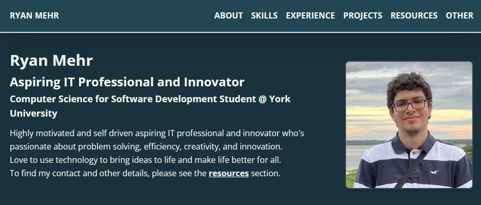

# ryanm055.github.io

# Purpose
A personal portfolio website using Github Pages ( too broke for hosting :/ ) to showcase my projects, skills, and experience.

### TODO soon.
* For technical skills, add grid of icons when screen is large.
* Add icons to teck stack part of each project.
* If necessary, make the other section about your interests, hobbies, etc.

.